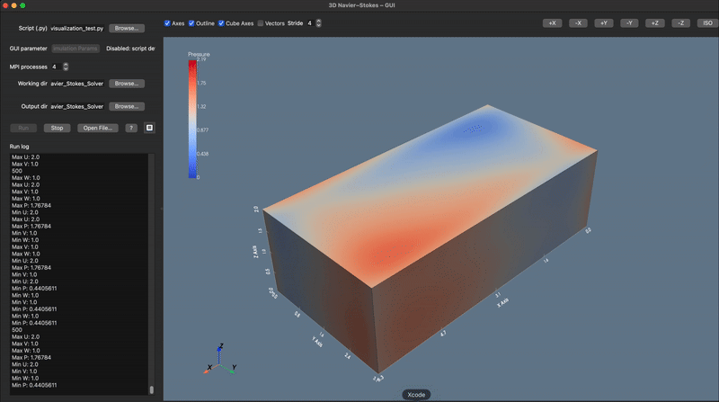

# ExaFlow

ExaFlow solves the incompressible Navier-Stokes equations, which describe how a fluid such as air or water moves, on a 1D, 2D, or 3D grid. It splits the grid across MPI processes so a large case runs in parallel, and its desktop GUI shows the flow while the solver runs.

<p align="center">
  
</p>

## Install

Install [uv](https://docs.astral.sh/uv/), then run this in the repository:

```bash
uv sync
```

This builds `.venv` with Python 3.13, every dependency, and Open MPI. Start every command below with `uv run`.

Open MPI has no Windows wheel, so on Windows install Microsoft MPI once and then open a new terminal:

```powershell
winget install Microsoft.msmpi
```

## Run a case

```bash
uv run exaflow run --case examples/input_template.xml
```

To split the run across four MPI processes:

```bash
uv run mpiexec -n 4 exaflow run --case examples/input_template.xml
```

The template runs 1000 steps on a 100x100x50 grid, so lower `<nt>` in the file for a quick test. `src/exaflow/gui/presets/` holds three more cases.

## Open the GUI

```bash
uv run python run_gui.py
```

Pick a case in the Preset box, set the number of processes, and press Run. The viewer updates as the solver runs.

## Output

Each run writes to a new folder under `~/Documents/ExaFlow`, named by its start time and case, such as `2026-08-24_200239_input_template/`. The folder holds checkpoint files such as `Checkpoint_100.csv` and `Checkpoint_Final.csv`. Set `EXAFLOW_OUTPUT_ROOT` to write somewhere else:

```bash
EXAFLOW_OUTPUT_ROOT=/tmp/exaflow-runs uv run exaflow run --case examples/input_template.xml
```

## The case file

A case is one XML file. Copy `examples/input_template.xml` and change these settings; the rest can stay as they are.

- `<Rho>` and `<Nu>`: fluid density and kinematic viscosity.
- `<Length>`, `<Width>`, `<Height>`: domain size in meters.
- `<nx>`, `<ny>`, `<nz>`: grid cells on each axis. Set `<nz>` to 0 for a 2D case, and `<ny>` and `<nz>` to 0 for 1D.
- `<nt>`: number of time steps.
- `<InitialConditions>`: starting pressure `p` and velocity `u`, `v`, `w`.
- `<BoundaryConditions>`: one type per face (`<LeftWall>`, `<RightWall>`, and so on), chosen from `No Slip Wall`, `Slip Wall`, `Inflow`, `Outflow`, and `Periodic`. A periodic face needs its opposite face periodic too.
- `<CheckpointFrequency>`: steps between checkpoint files, or -1 for none.

Pressure projection, which keeps the flow incompressible, is off by default; set `<IncludePressureEffects>True</IncludePressureEffects>` to turn it on.

## Tests and type checks

```bash
uv run pytest
uv run mypy src tests
uv run mypy examples packaging run_gui.py Simulations
```

`uv run pytest -m "not mpi and not gui"` skips the tests that start `mpiexec` or load the GUI libraries.

## Source tree

```
src/exaflow/
    config/ # the case: fluid, grid, boundaries, time control, and the XML reader
    mpi/ # splits the grid across processes and swaps edge data between them
    numerics/ # convection, diffusion, pressure, and Runge-Kutta time steps
    io/ # checkpoint files and the run folder
    gui/ # the desktop app and its 3D viewer
    session.py # the time loop of one run
    run.py # run_case, the Python entry point
    cli.py # the exaflow command
examples/ # the input template and a Python API example
tests/ # the pytest suite, one module per source module
```

Start with `src/exaflow/cli.py` and follow it into `run.py` and `session.py`. Read `src/exaflow/numerics/README.md` before you change a numerical operator.

`benchmarks/` holds timing scripts and three case sizes, for example `uv run python benchmarks/whole_simulation.py benchmarks/cases/small_50x50x25.xml`.

[docs/development.md](docs/development.md) covers resuming a run, the Python API, checkpoint formats, the desktop app build, and the test layout.
